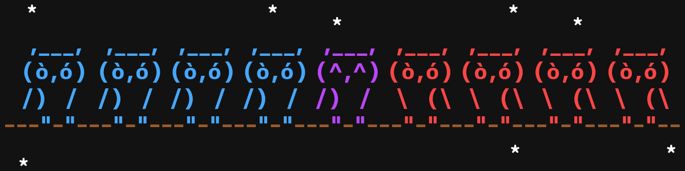

# THIS PAGE IS A WORK IN PROGRESS AND IS NOT ACCURATE AND IS A TEMPLATE

<div align="center">
  
</div>

<!-- # Ozark Cybersecurity Research Group -->

<!-- <div class="hero">
  <h1>OCRG_Terminal v1.0</h1>
  <p>Advancing cybersecurity through innovative research and secure techniques</p>
</div> -->

```bash
$ whoami
ocrg_user

$ ls -la /research
total 42
drwxr-xr-x  3 ocrg staff  4096 Mar 25 2025 threat-detection/
drwxr-xr-x  2 ocrg staff  4096 Mar 25 2025 steganalysis/
-rw-r--r--  1 ocrg staff  8192 Mar 25 2025 README.md
```

## Mission

> We are dedicated to advancing cybersecurity knowledge through cutting-edge research, education, and community collaboration.

<div class="placeholder-image purple">
  <span>Purple Team Operations</span>
  <small>Security assessments through the eyes of attackers and defenders</small>
</div>

## Research Areas

<div class="grid cards" markdown>

- :shield: __Threat Detection__
    ---
    Advanced methodologies for identifying and responding to emerging cyber threats.
    [:octicons-arrow-right-24: Learn more](research/threat-detection.md)

- :lock: __Secure Systems Design__
    ---
    Building resilient systems with security at their core.
    [:octicons-arrow-right-24: Get started](#)

- :microscope: __Steganalysis__
    ---
    Detection of hidden information in digital media.
    [:octicons-arrow-right-24: Read more](research/steganalysis.md)

</div>

## Latest Updates

!!! blue "New Tool Release"
    Our team has released ___, enhancing capabilities for ___ ___ ___.
    [Check it out :fontawesome-solid-download:](#)

!!! purple "___ ___ Exercise"
    Registration now open for our annual ___ event happening in May.
    [Register now :fontawesome-solid-user-plus:](#)

!!! red "Security Alert"
    Critical vulnerability in ___. See our advisory for mitigation steps.
    [Read advisory :fontawesome-solid-triangle-exclamation:](#)

## Featured Project

<div class="placeholder-image blue">
  <span>Network Behavior Analysis System</span>
  <small>AI-powered network traffic analysis for anomaly detection</small>
</div>

## Technical Demonstrations

=== "Terminal Commands"

    ```bash
    $ ocrg-scan --target 192.168.1.0/24 --passive
    [*] Initiating passive scan of network
    [*] Discovered 12 active hosts
    [*] Identifying services...
    [+] Complete! Report saved to ~/ocrg-results.json
    ```

=== "Python Example"

    ```python
    from ocrg.scanner import NetworkScanner
    
    # Initialize scanner with custom configuration
    scanner = NetworkScanner(
        target="192.168.1.0/24",
        passive=True,
        fingerprinting=True
    )
    
    # Run scan and get results
    results = scanner.scan()
    scanner.generate_report("results.json")
    ```

=== "Research Data"

    ```json
    {
      "vulnerability_trends": {
        "2024": {
          "q1": 342,
          "q2": 289,
          "q3": 401,
          "q4": 356
        },
        "2025": {
          "q1": 298
        }
      }
    }
    ```

## Community Involvement

<div class="placeholder-image red">
  <span>Security Awareness Training Program</span>
  <small>Building a security-conscious community</small>
</div>

## Get Involved

Join our community of researchers, practitioners, and enthusiasts. There are many ways to participate:

- [Contribute to our projects](documentation/contributing.md)
- [Participate in security research](research/index.md)
- [Join our Discord server](https://discord.gg/6SDUxJzSdr)

<a href="documentation/getting-started.md" class="md-button md-button--primary">Get Started</a>
<a href="about.md" class="md-button">Learn More</a>
