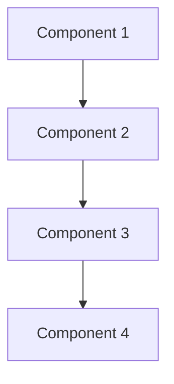

# Project Name

<div class="hero">
  <h1>Project Overview</h1>
  <p>Lorem ipsum dolor sit amet, consectetur adipiscing elit. Sed do eiusmod tempor incididunt ut labore et dolore magna aliqua.</p>
</div>

## Project Description

Lorem ipsum dolor sit amet, consectetur adipiscing elit. Ut enim ad minim veniam, quis nostrud exercitation ullamco laboris nisi ut aliquip ex ea commodo consequat.

## Features

- **Feature 1:** Lorem ipsum dolor sit amet, consectetur adipiscing elit.
- **Feature 2:** Ut enim ad minim veniam, quis nostrud exercitation.
- **Feature 3:** Duis aute irure dolor in reprehenderit in voluptate.

## Technical Details

### Architecture



### Implementation

```python
from example import ExampleClass

# Initialize with configuration
example = ExampleClass(
    option1="value1",
    option2="value2"
)

# Execute and get results
results = example.execute()
```

## Getting Started

1. **Prerequisites**
   ```bash
   # Install dependencies
   pip install -r requirements.txt
   ```

2. **Configuration**
   ```bash
   # Set up configuration
   cp config.example.yaml config.yaml
   # Edit config.yaml with your settings
   ```

3. **Usage**
   ```bash
   # Run the project
   python main.py
   ```

## Documentation

For detailed documentation, please refer to:

- [Installation Guide](installation.md)
- [User Manual](manual.md)
- [API Reference](api.md)
- [Contributing Guide](contributing.md)

## Contributing

We welcome contributions! Please see our [Contributing Guide](contributing.md) for details.

## License

This project is licensed under the MIT License - see the [LICENSE](LICENSE) file for details.

## Support

For support, please:

- Open an issue on GitHub
- Join our Discord server
- Contact the maintainers

<div style="text-align: center; margin: 2rem 0;">
  <a href="https://github.com/OCRG/project-name" class="md-button md-button--primary">GitHub Repository</a>
  <a href="../contact" class="md-button">Contact Us</a>
</div> 